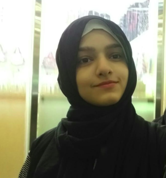

<!DOCTYPE html>
 <html class="no-js"> 
    <head>
        <meta charset="utf-8">
        <meta http-equiv="X-UA-Compatible" content="IE=edge">
        <title></title>
        <meta name="description" content="">
        <meta name="viewport" content="width=device-width, initial-scale=1">
        <link rel="stylesheet" href="mystyles.css">
        <link rel="stylesheet" href="https://stackpath.bootstrapcdn.com/bootstrap/4.5.0/css/bootstrap.min.css" integrity="sha384-9aIt2nRpC12Uk9gS9baDl411NQApFmC26EwAOH8WgZl5MYYxFfc+NcPb1dKGj7Sk" crossorigin="anonymous">
        
        <link rel="shortcut icon" href="media/ICON -1.png" />

    </head>
    <body>

        <!-- header -->
        <nav id = "mynav" >
        

            
            About The Team
            <strong>Remind Me App</strong>

            

        

            

        </nav>

    <!-- card views for members -->
    

       
        

            

              
              

                
 Usama Altaf Zahid

                
Techinical Supervisor

                
Electrical Engineering

                
<a href="https://github.com/Usama3059">Connect on Github </a>
                
                

            

            

          

   
          

            

              
              

                
Maheen Ahmed

                
Technical Director

                
Electrical Engineering

                
<a href="https://github.com/maheenahmed">Connect on Github </a>
                
                

            

            

          

          

            

              
              

                
Maheen Saleh

                
Technical Co-Director

                
Computer Systems Engineering

                
<a href="https://github.com/maheensaleh">Connect on Github </a>
                
                

            

            

          

          

            

              
              

                
Maryum Raza

                
Team Member

                
Computer Systems Engineering

                
<a href="https://github.com/maryumraza">Connect on Github </a>
                
                

            

            

          

          

            

              
              

                
Hiba Asad

                
Team Member

                
Computer Systems Engineering

                
<a href="https://github.com/hibaasad">Connect on Github </a>
                
                

            

            

          

          

            

              
              

                
Areesha Afzal

                
Team Member

                
Computer Systems Engineering

                
<a href="https://github.com/areesha04">Connect on Github </a>
                
                

            

            

          

          

            

              
              

                
Sara Fatima

                
Team Member

                
Computer Systems Engineering

                
<a href="https://github.com/sara-fatima321">Connect on Github </a>
                
                

            

            

          

          

            

              
              

                
Wareesha Nasir

                
Team Member

                
Software Engineering

                
<a href="https://github.com/wareesha-nasir">Connect on Github </a>
                
                

            

            

          

          

            

              
              

                
Areesha Mujahid

                
Team Member

                
Computer Systems Engineering

                
<a href="https://github.com/AreeshaMujahid">Connect on Github </a>
                
                

            

            

          

   
          

            

              
              

                
Laila Siddique

                
Team Member

                
Computer Systems Engineering

                
<a href="https://github.com/orgs/IEEE-WIE-NEDUET-2020/people/L-S2019">Connect on Github </a>
                
                

            

            

          

          

            

              
              

                
Fatima Ali

                
Team Member

                
Computer Systems Engineering

                
<a href="https://github.com/FatimaAli466">Connect on Github </a>
                
                

            

            

          

          

            

              
              

                
Misha Akram 

                
Team Member

                
Computer Systems Engineering

                
<a href="https://github.com/MishaAkram">Connect on Github </a>
                
                

            

            

          

          

            

              
              

                
Nabeeha Ejaz

                
Team Member

                
Computer Systems Engineering

                
<a href="https://github.com/Nabeeha218">Connect on Github </a>
                
                

            

            

          

          

            

              
              

                
Tarab Zehra

                
Team Member

                
Computer Systems Engineering

                
<a href="https://github.com/tarabzehra">Connect on Github </a>
                
                

            

            

          

          

            

              
              

                
Syeda Mahnoor

                
Team Member

                
Computer Systems Engineering

                
<a href="https://github.com/hibaasad">Connect on Github </a>
                
                

            

            

          

          

            

              
              

                
Kazim Rizwi

                
Team Member

                
Electrical Engineering

                
                

            

            

          

      

        
    </body>

      </html>
